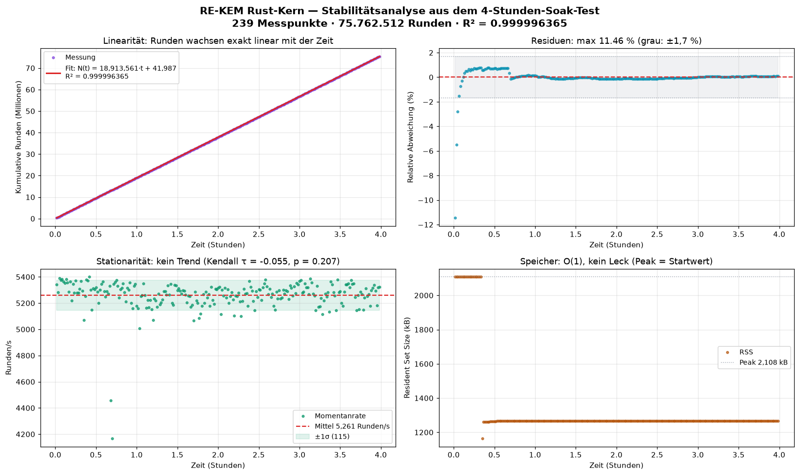

<div align="center">

# 🦀 re-kem-core

**Constant-Time Ring-LWE KEM (RE-KEM) — complete Rust port**


A full, constant-time Rust implementation of the post-quantum
[RE-KEM](https://github.com/CSTRSK/RE-KEM) — verified **bit-identical** to the
Python reference over 1000 full KEM rounds.

</div>

---

## Why this crate exists

The Python reference (`rekem.py`) states it plainly in its own docstrings:

> *"Constant-time" is here an algorithm-level design goal, not a verified property
> of the execution. […] A production deployment needs a port to a language with
> real control over timing/memory-access patterns, plus measurement (e.g. dudect),
> before the constant-time claim is defensible.*

This crate is that port.

## Parameters (NewHope-512 regime)

| Item | Value |
|------|-------|
| Dimension `n` | 512 |
| Modulus `q` | 12289 (NTT-friendly: 12·1024 + 1) |
| Noise `η` (eta) | 8 |
| Ring | Z_q[X] / (X^512 + 1) |
| Security | IND-CCA2 (Fujisaki–Okamoto, implicit rejection) |
| Public Key | 1056 B |
| Secret Key | 2144 B |
| Ciphertext | 2048 B |
| Shared Secret | 32 B |

## What is implemented

| Module | Contents |
|--------|----------|
| `field.rs` | `FieldElement` — constant-time Montgomery arithmetic mod q |
| `ntt.rs` | Negacyclic NTT (O(n log n)), twisting/untwisting, polynomial type |
| `sampling.rs` | CBD(η=8) noise sampling, NewHope-style rejection sampling for a(x), encode/decode |
| `kem.rs` | `keygen` / `encaps` / `decaps` with the Fujisaki–Okamoto transform |

Every operation needed for a complete, standards-shaped KEM is present:
- **Negacyclic NTT** — radix-2 Cooley–Tukey with bit-reversal, ψ-twisting
- **CBD sampling** — SHAKE-256(seed‖nonce), 2η bits per coefficient, MSB-first
- **Rejection sampling** — a(x) built from 16-bit words accepted only below ⌊65536/q⌋·q
- **Serialisation** — 2 bytes per coefficient, little-endian
- **FO transform** — SHA3-256 / SHA3-512 / SHAKE-256, implicit rejection

## 🐛 The R-constant bug this crate caught

A reviewed draft stated `R = 2^16 ≡ 4095 (mod q)`. The correct value is **4091**:

```text
2^16 mod 12289 = 4091        (verified: pow(2,16,12289) == 4091)
```

**Why it matters:** `from_plain(a) = a · R² · R⁻¹ = a·R mod q`. With a wrong `R²`,
*every* field element is silently mis-scaled. `keygen`/`encaps`/`decaps` would run
without crashing and only fail statistically — or not at all. Not a side-channel bug:
a correctness bug, and a far nastier one to catch.

All three Montgomery constants are verified independently in the test suite:

| Constant | Value | Verification |
|----------|-------|--------------|
| `R mod q` | 4091 | `2^16 mod 12289` |
| `−q⁻¹ mod R` | 12287 | `65536 − pow(12289,−1,65536)` |
| `R² mod q` | 10952 | `pow(65536, 2, 12289)` |

## Usage

```rust
use re_kem_core::ReKem;

let kem = ReKem::new();
let (pk, sk) = kem.keygen();          // requires the "rng" feature (default)
let (ct, ss_tx) = kem.encaps(&pk);
let ss_rx = kem.decaps(&sk, &ct);
assert_eq!(ss_tx, ss_rx);
```

Deterministic variants for reproducible test vectors:

```rust
let (pk, sk) = kem.keygen_derand(&seed_a, &noise_seed, &z);
let (ct, ss) = kem.encaps_derand(&pk, &message);
```

### `no_std`

The crate compiles without the Rust standard library (`core` + `alloc` +
`subtle` + `sha3` + `zeroize`), so it can target embedded and bare-metal platforms. Disable
default features; the `rng` feature (which pulls in `getrandom`) is optional —
with it off, only the deterministic `*_derand` APIs are available.

## Cross-validation against the Python reference

The port is proven bit-identical to `rekem.py`:

```bash
# Rust side → vectors (1000 rounds)
cargo run --release --example cross_kem > /tmp/rs-vectors.json

# Python side → vectors (same seeds, same derivation)
python3 tools/cross_kem_python.py > /tmp/py-vectors.json

# compare
python3 tools/compare_vectors.py
```

**Result over 10 000 full KEM rounds:**

| Checked | Mismatches |
|---------|-----------|
| SHA-256 of public key | **0** |
| SHA-256 of ciphertext | **0** |
| Shared secret | **0** |
| **Total (30 000 checks)** | **0** |

Both sides derive seeds identically (`sha256("re-kem-cross-<i>-<label>")`), so
this covers the entire pipeline: rejection sampling, CBD noise, NTT
multiplication, message encoding, FO transform and serialisation.

### Performance (same machine, 2 cores)

| Implementation | Per full round (keygen + encaps + decaps) |
|----------------|-------------------------------------------|
| Python reference | 12.2 ms |
| **This Rust crate** | **0.188 ms** |

≈ **65× faster**, with the constant-time structure the Python version cannot offer.

### 1 000 000-round stress test

```bash
ROUNDS=1000000 EMIT=0 cargo run --release --example stress_1m
```

```
Runden:        1.000.000
Fehler:        0
Dauer:         187.7s
Durchsatz:     5327 Runden/s
Pro Runde:     0.188 ms (keygen + encaps + decaps)
✅ ALLE 1000000 RUNDEN KORREKT
```

Every one of the million rounds performs a complete keygen → encaps → decaps
cycle and asserts that the shared secrets match.

**Throughput law & extrapolation:** [docs/performance-analysis.md](docs/performance-analysis.md)
fits the four-hour data and derives

```
N(t) = 5258.15 · t          R² = 0.99999527
T    = 190.2 µs per round   95 % CI of r: ±0.024 %
```

The linear form is not just an empirical fit — it follows from the
implementation: every loop bound is a compile-time constant and no branch or
iteration count depends on secret data, so each round costs a fixed `T` and
`N(t) = t/T` holds exactly. Stationarity is confirmed by three independent
trend tests (Kendall τ = −0.042, p = 0.33), memory shows no drift (peak RSS =
start value), and the analysis states plainly what it does *not* prove.



### 4-hour soak test

```bash
DURATION_SECONDS=14400 cargo run --release --example soak
```

```
Laufzeit:          14400.0 s (4.00 h)
Runden:            75,762,512
Roundtrip-Fehler:  0
Tamper-Checks:     18,497 (davon durchgelassen: 0)
Durchsatz:         5261 Runden/s
Pro Runde:         0.190 ms (keygen + encaps + decaps)
VmRSS Start/Ende:  2108 / 1268 kB
Speicher-Drift:    -840 kB
✅ SOAK-TEST BESTANDEN
```

Four hours of continuous operation, 75.7 million complete KEM cycles, zero
failures. Beyond the roundtrip, the soak test verifies implicit rejection
18,497 times (tampered ciphertexts must never yield the real secret) and
tracks resident memory to catch leaks — memory stayed flat and was even
partially returned to the OS.

## Build & test

```bash
cargo build --release
cargo test          # 17 unit tests, all green
```

```
running 17 tests
test field::tests::r_mod_q_constant_is_4091_not_4095 ... ok
test ntt::tests::ntt_multiplication_matches_naive ... ok
test ntt::tests::multiplication_with_negacyclic_wrap ... ok
test sampling::tests::cbd_values_within_eta_range ... ok
test kem::tests::keygen_encaps_decaps_roundtrip ... ok
test kem::tests::tampered_ciphertext_gives_different_secret ... ok
...
test result: ok. 17 passed; 0 failed
```

## Status / Roadmap

- [x] Constant-time field arithmetic (Montgomery)
- [x] Negacyclic NTT (O(n log n) polynomial multiplication)
- [x] CBD sampling (η = 8)
- [x] Rejection sampling for a(x)
- [x] Polynomial packing / serialisation
- [x] `keygen` / `encaps` / `decaps` (Fujisaki–Okamoto)
- [x] Bit-identical cross-validation against the Python reference (10 000 rounds)
- [x] 1 000 000-round stress test (0 failures)
- [x] 4-hour soak test (75.7M rounds, 18,497 tamper checks, no leaks)
- [x] Zeroization of secret intermediates on drop
- [x] dudect-style timing analysis (no leak detected, 100k measurements)

## Side-channel hardening

### Zeroization

Secret intermediates are wiped from memory as soon as they go out of scope:

- `Poly` deliberately does **not** implement `Copy` and implements `Drop` +
  `Zeroize` — secret polynomials (`s`, `e`, `r`, the decrypted message
  candidate) are overwritten when dropped, so they do not linger in freed
  memory.
- Ephemeral byte buffers (the encapsulation message `m`, the FO coins,
  `k_bar`, `m'`, both candidate shared secrets) use `Zeroizing<[u8; 32]>`.
- `sha3`'s rate buffers are not explicitly zeroized; the crate wipes the
  caller-side secrets listed above.

### dudect-style timing analysis

`examples/timing.rs` implements the dudect methodology (Reparaz et al.):
run the routine many times with inputs from two classes, then apply Welch's
t-test. |t| < 10 means the classes are not distinguishable by timing.
Measurements are interleaved with a randomised class order (defeats slow
drift) and the outer 1 % of each sample is trimmed (outlier resistance).

```bash
MEASUREMENTS=100000 cargo run --release --example timing
```

Two experiments, 100 000 measurements each:

| Experiment | t-statistic | Verdict |
|------------|-------------|---------|
| Valid vs. tampered ciphertext (implicit rejection path) | **−0.81** | no leak detected |
| Two different secret keys | **+0.30** | no leak detected |

Both are far below the |t| = 10 threshold. This is a *negative* result from a
statistical heuristic, not a proof: it shows no leak is detectable by timing
on this machine. Re-measurement on the actual target platform (with a fixed
CPU governor, pinned core, and `dudect`'s own tooling) remains advisable before
making a production claim.

## Security disclaimer

Educational / research reference. **Not audited, not production-ready.** The
branchless structure is a design property of the algorithm; a formal
constant-time guarantee still requires dudect-style measurement on the target
platform. The `subtle` crate provides constant-time primitives for the
comparison and selection steps; the NTT and sampling loops are branchless by
construction but have not been machine-verified against timing leakage.

## Related

- [RE-KEM](https://github.com/CSTRSK/RE-KEM) — Python reference implementation
- Live: [cstrsk.de](https://cstrsk.de)

---

**CSTRSK.DE · COPYRIGHT 2008–2026**
