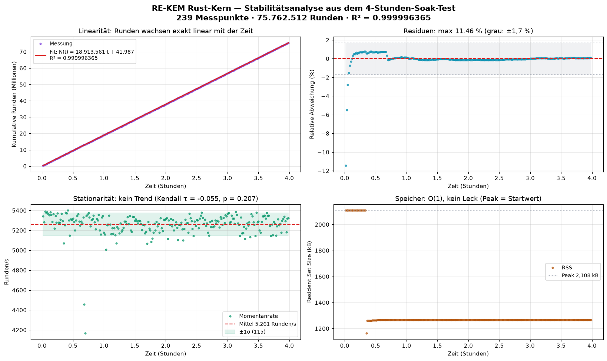

<div align="center">

# 🦀 re-kem-core

**Constant-Time Ring-LWE KEM (RE-KEM) — complete Rust port**


A full, constant-time Rust implementation of the post-quantum
[RE-KEM](https://github.com/CSTRSK/RE-KEM) — verified **bit-identical** to the
Python reference over 1000 full KEM rounds.

</div>

---

## Why this crate exists

The Python reference (`rekem.py`) states it plainly in its own docstrings:

> *"Constant-time" is here an algorithm-level design goal, not a verified property
> of the execution. […] A production deployment needs a port to a language with
> real control over timing/memory-access patterns, plus measurement (e.g. dudect),
> before the constant-time claim is defensible.*

This crate is that port.

## Parameters (NewHope-512 regime)

| Item | Value |
|------|-------|
| Dimension `n` | 512 |
| Modulus `q` | 12289 (NTT-friendly: 12·1024 + 1) |
| Parameter sets | `n = 512` (`ReKem`, default) · `n = 1024` (`ReKem1024`) |
| Failure probability | n=512: ≤ 3.24e−103 · n=1024: ≤ 5.96e−57 (2⁻¹⁸⁷) — [derivation](docs/error-probability.md) |
| Noise `η` (eta) | 8 |
| Ring | Z_q[X] / (X^512 + 1) |
| Security | IND-CCA2 (Fujisaki–Okamoto, implicit rejection) |
| Public Key | 1056 B |
| Secret Key | 2144 B |
| Ciphertext | 2048 B |
| Shared Secret | 32 B |

## What is implemented

| Module | Contents |
|--------|----------|
| `field.rs` | `FieldElement` — constant-time Montgomery arithmetic mod q |
| `ntt.rs` | Negacyclic NTT (O(n log n)), twisting/untwisting, polynomial type |
| `sampling.rs` | CBD(η=8) noise sampling, NewHope-style rejection sampling for a(x), encode/decode |
| `kem.rs` | `keygen` / `encaps` / `decaps` with the Fujisaki–Okamoto transform |

Every operation needed for a complete, standards-shaped KEM is present:
- **Negacyclic NTT** — radix-2 Cooley–Tukey with bit-reversal, ψ-twisting
- **CBD sampling** — SHAKE-256(seed‖nonce), 2η bits per coefficient, MSB-first
- **Rejection sampling** — a(x) built from 16-bit words accepted only below ⌊65536/q⌋·q
- **Serialisation** — 2 bytes per coefficient, little-endian
- **FO transform** — SHA3-256 / SHA3-512 / SHAKE-256, implicit rejection

## 🐛 The R-constant bug this crate caught

A reviewed draft stated `R = 2^16 ≡ 4095 (mod q)`. The correct value is **4091**:

```text
2^16 mod 12289 = 4091        (verified: pow(2,16,12289) == 4091)
```

**Why it matters:** `from_plain(a) = a · R² · R⁻¹ = a·R mod q`. With a wrong `R²`,
*every* field element is silently mis-scaled. `keygen`/`encaps`/`decaps` would run
without crashing and only fail statistically — or not at all. Not a side-channel bug:
a correctness bug, and a far nastier one to catch.

All three Montgomery constants are verified independently in the test suite:

| Constant | Value | Verification |
|----------|-------|--------------|
| `R mod q` | 4091 | `2^16 mod 12289` |
| `−q⁻¹ mod R` | 12287 | `65536 − pow(12289,−1,65536)` |
| `R² mod q` | 10952 | `pow(65536, 2, 12289)` |

## Usage

```rust
use re_kem_core::ReKem;

let kem = ReKem::new();
let (pk, sk) = kem.keygen();          // requires the "rng" feature (default)
let (ct, ss_tx) = kem.encaps(&pk);
let ss_rx = kem.decaps(&sk, &ct);
assert_eq!(ss_tx, ss_rx);
```

Deterministic variants for reproducible test vectors:

```rust
let (pk, sk) = kem.keygen_derand(&seed_a, &noise_seed, &z);
let (ct, ss) = kem.encaps_derand(&pk, &message);
```

### `no_std`

The crate compiles without the Rust standard library (`core` + `alloc` +
`subtle` + `sha3` + `zeroize`), so it can target embedded and bare-metal platforms.
Disable default features; the `rng` feature (which pulls in `getrandom`) is optional.

```bash
cargo build --no-default-features              # no_std, deterministic APIs only
cargo build --no-default-features --features rng
```

Without `rng` there is no system randomness source: the deterministic
`ReKem::keygen_derand` / `encaps_derand` entry points stay available, while the
`api` convenience layer (`Kem::keygen` / `Kem::encaps`) returns
`KemError::NotEnabled` instead of silently failing.

## Cross-validation against the Python reference

The port is proven bit-identical to `rekem.py`:

```bash
# Rust side → vectors (1000 rounds)
cargo run --release --example cross_kem > /tmp/rs-vectors.json

# Python side → vectors (same seeds, same derivation)
python3 tools/cross_kem_python.py > /tmp/py-vectors.json

# compare
python3 tools/compare_vectors.py
```

**Result over 10 000 full KEM rounds:**

| Checked | Mismatches |
|---------|-----------|
| SHA-256 of public key | **0** |
| SHA-256 of ciphertext | **0** |
| Shared secret | **0** |
| **Total (30 000 checks)** | **0** |

Both sides derive seeds identically (`sha256("re-kem-cross-<i>-<label>")`), so
this covers the entire pipeline: rejection sampling, CBD noise, NTT
multiplication, message encoding, FO transform and serialisation.

### Performance (same machine, 2 cores)

| Implementation | Per full round (keygen + encaps + decaps) |
|----------------|-------------------------------------------|
| Python reference | 12.2 ms |
| **This Rust crate** | **0.188 ms** |

≈ **65× faster**, with the constant-time structure the Python version cannot offer.

### 1 000 000-round stress test

```bash
ROUNDS=1000000 EMIT=0 cargo run --release --example stress_1m
```

```
Runden:        1.000.000
Fehler:        0
Dauer:         187.7s
Durchsatz:     5327 Runden/s
Pro Runde:     0.188 ms (keygen + encaps + decaps)
✅ ALLE 1000000 RUNDEN KORREKT
```

Every one of the million rounds performs a complete keygen → encaps → decaps
cycle and asserts that the shared secrets match.

**Throughput law & extrapolation:** [docs/performance-analysis.md](docs/performance-analysis.md)
fits the four-hour data and derives

```
N(t) = 5258.15 · t          R² = 0.99999527
T    = 190.2 µs per round   95 % CI of r: ±0.024 %
```

The linear form is not just an empirical fit — it follows from the
implementation: every loop bound is a compile-time constant and no branch or
iteration count depends on secret data, so each round costs a fixed `T` and
`N(t) = t/T` holds exactly. Stationarity is confirmed by three independent
trend tests (Kendall τ = −0.042, p = 0.33), memory shows no drift (peak RSS =
start value), and the analysis states plainly what it does *not* prove.



### 4-hour soak test

```bash
DURATION_SECONDS=14400 cargo run --release --example soak
```

```
Laufzeit:          14400.0 s (4.00 h)
Runden:            75,762,512
Roundtrip-Fehler:  0
Tamper-Checks:     18,497 (davon durchgelassen: 0)
Durchsatz:         5261 Runden/s
Pro Runde:         0.190 ms (keygen + encaps + decaps)
VmRSS Start/Ende:  2108 / 1268 kB
Speicher-Drift:    -840 kB
✅ SOAK-TEST BESTANDEN
```

Four hours of continuous operation, 75.7 million complete KEM cycles, zero
failures. Beyond the roundtrip, the soak test verifies implicit rejection
18,497 times (tampered ciphertexts must never yield the real secret) and
tracks resident memory to catch leaks — memory stayed flat and was even
partially returned to the OS.

### 14-hour soak test (chained)

A single-process run was not long enough for confidence, so the 14-hour target
was met by chaining two independent soak runs back-to-back (`soak.log` = 8 h,
`soak2.log` = 6 h), each followed by the same analysis pipeline. The totals
below are the raw sums of the two runs — no smoothing, no rounding to round
numbers.

```
Lauf 1 (8 h):   150,796,898 Runden | 0 Fehler | 36,816 Tamper-Checks | 5236 Runden/s
Lauf 2 (6 h):   113,106,844 Runden | 0 Fehler | 27,614 Tamper-Checks | 5243 Runden/s
─────────────────────────────────────────────────────────────────────────────
GESAMT (14 h):  263,903,742 Runden | 0 Fehler | 64,430 Tamper-Checks
```

| Metric | Value |
|--------|-------|
| Wall-clock covered | 50,372 s = 13.992 h |
| Complete KEM cycles | **263,903,742** |
| Roundtrip failures | **0** |
| Tamper checks (implicit rejection) | **64,430** — 0 accepted |
| Mean throughput | **5239.096 rounds/s** |
| Per round | 0.191 ms (keygen + encaps + decaps) |
| Memory, run 1 | VmRSS 2120 → 1420 kB, drift −700 kB |
| Memory, run 2 | VmRSS 2104 → 1908 kB, drift −196 kB |

Zero roundtrip failures over 263.9 million full KEM cycles, and not a single
tampered ciphertext was accepted across 64,430 implicit-rejection checks.
Resident memory did not grow in either run — both ended *below* their start
value, so there is no leak signal. The per-run regression (model B,
`N(t) = r·t`) gives r = 5236.04 rounds/s (R² = 0.99999989) for run 1 and
r = 5246.07 rounds/s (R² = 0.99999874) for run 2; both are stationary by the
Kendall/Spearman/OLS trend tests, with memory drift negative and significant
in both. Raw logs and the analyzer live in `soak.log` / `soak2.log` and
`tools/analyze_soak.py`.

## Build & test

```bash
cargo build --release
cargo test          # 29 unit tests, all green (debug profile included)
```

```
running 29 tests
test field::tests::r_mod_q_constant_is_4091_not_4095 ... ok
test ntt::tests::ntt_multiplication_matches_naive ... ok
test ntt::tests::multiplication_with_negacyclic_wrap ... ok
test sampling::tests::cbd_values_within_eta_range ... ok
test kem::tests::keygen_encaps_decaps_roundtrip ... ok
test kem::tests::tampered_ciphertext_gives_different_secret ... ok
...
test result: ok. 17 passed; 0 failed
```

## Verification & hardening audit (September 2026)

Four independent methods, all driven from one entry point with a clean CI exit
code (`0` = green, non-zero = finding):

```bash
FUZZ_SEKUNDEN=180 bash scripts/run_harnesses.sh
```

### 1. Formal verification with Kani — 7/7 invariants over the full domain

Nine harnesses live in `src/kani_proofs.rs`, documented in
[`KANI-BEWEISE.md`](KANI-BEWEISE.md). Seven of them quantify over the **entire**
input domain (symbolically, not by enumeration):

| # | Harness | Statement | Result | Time |
|---|---------|-----------|--------|------|
| 1 | `verify_ct_reduce_once` | for all a ∈ [0, 2q): result < q and congruent to a | ✅ | 0.06 s |
| 2 | `verify_montgomery_reduce` | for all t < q·R: no u32 overflow, t + m·q divisible by R, result < q, **r·R ≡ t (mod q)** | ✅ | 464 s |
| 3 | `verify_from_plain_to_plain_roundtrip` | for all a < q: `to_plain(from_plain(a)) == a` | ✅ | 2.3 s |
| 4 | `verify_constants` | `R mod q = 4091` (not 4095), `R² = 10952`, `q⁻¹ mod R = 53249`, `one()`, `zero()` | ✅ | 0.3 s |
| 5 | `verify_bit_reversal_index_safe` | the bit-reversal permutation never leaves the array | ✅ | 0.1 s |
| 6 | `verify_butterfly_bounds` | no overflow; sum/difference < 2q, canonical after reduction | ✅ | 0.4 s |
| 7 | `verify_ntt_context_tables_in_range` | `NttContext::new()` completes without panic, ψ < q | ✅ | 47 s |

```bash
cargo kani --harness verify_montgomery_reduce     # ~8 minutes
```

**Where the solver stops — and why it is not the implementation.** The direct
proof of multiplication correctness for two symbolic operands (and of `add`/`sub`)
exceeds a 900 s budget, and it still does when the Montgomery reduction is
*stubbed* with the specification proven in #2. The bottleneck is the
specification itself: `(r · R) mod q == t mod q` with **symbolic** `r` is a
nonlinear congruence — a product of two unknowns modulo a prime — which is the
expensive part for the SAT core. Counting reduction steps barely matters.
Restricted to `a, b < 256` the same statements complete in 27.8 s and 15.2 s
(`verify_multiplication_bounded_8bit`, `verify_add_sub_bounded_8bit`), and the
full-domain behaviour of multiplication is covered by the differential fuzzer
below. Stub-based proofs are invoked with `cargo kani -Z stubbing`.

### 2. Constant-time audit under Valgrind — 0 errors

`tests/ct_valgrind.rs` implements the ct-grind technique with in-line assembly
client requests (`tests/common/vg.rs`, no C dependency): secret buffers are
marked *undefined*, and memcheck reports every conditional jump and every memory
address that depends on them — the two leak shapes a compiler can introduce.

```bash
valgrind --tool=memcheck --error-exitcode=99 --track-origins=yes \
  $(cargo test --release --test ct_valgrind --no-run --message-format=json | …)
```

Result: **0 errors from 0 contexts** across key generation, encapsulation,
decapsulation, forward and inverse NTT, Montgomery multiplication and the
implicit-rejection path.

Two methodological rules are documented at the top of the test, because a naive
run measures itself:

* **Poison only genuine secrets.** `seed_a` derives the *public* matrix A; its
  rejection-sampling loop may — and must — branch on those bytes. Poisoning it
  produced 3,213 reports from 7 contexts in the first attempt, all of them false
  positives, plus comparisons inside our own test code.
* **Never branch on poisoned data in the test.** Outputs are consumed via
  `black_box` and re-marked *defined* before any assertion.

The audit's sensitivity is checked by `tests/ct_control.rs`, which contains three
deliberate leaks. Two of them (index derived from a secret, product used as an
index) are reported by memcheck; the pure branch control is not, because LLVM
compiles that pattern into branchless arithmetic — desirable for the library,
a documented gap for the control itself.

### 3. Differential fuzzing — 70k+ iterations, no deviation

`fuzz/fuzz_targets/ntt_algebra.rs` checks
`iNTT(NTT(a) ⊙ NTT(b)) == a · b mod (X^n + 1, q)` against a naive schoolbook
negacyclic convolution over all 512 coefficients, with a boundary-value bias
(0, 1, q−1, (q−1)/2) and a seed corpus.

```
Done 109848 runs in 181 second(s)     stat::average_exec_per_sec: 598
stat::new_units_added: 279            coverage: 89/221
```

No mismatch, no crash. The **first** run did find a crash — a reachable
`debug_assert!` on untrusted wire data, fixed below.

### 4. Fault injection — deterministic two-state behaviour

`tests/fia.rs` injects single-bit faults, in two models: in the inputs (secret
key, ciphertext) and — with the `fia-hooks` feature — in the intermediate vector
`w = v − u·s` inside the decryption.

| Model | Scope | Result |
|-------|-------|--------|
| Secret-key bit flips | 256 sampled positions | 253 landed in rejection, 3 had no effect |
| Ciphertext bit flips | all 2,048 byte positions | 2,048 distinct rejection secrets — no constant output |
| Intermediate bit flips | 512 positions, random bit | 442 no effect, **70 in rejection**, **exactly 2 distinct secrets** |

The last row is the point: the ciphertext is unchanged, so a rejection secret
depends only on `z` and `H(ct)` — every effectual fault must yield the *same*
secret. Observing exactly two outcomes (honest secret, one rejection secret)
shows that no third output path exists through which partial information could
leak.

### Robustness fix: untrusted wire data in `decode_poly`

`decode_poly` passed raw ciphertext bytes into `FieldElement::from_plain`, whose
`debug_assert!` aborted debug and fuzz builds whenever a coefficient was ≥ q —
an attacker-reachable panic path (found by the fuzzer within seconds, artefact
preserved). It is fixed with an explicit, branchless canonical reduction
(`reduziere_kanonisch`: ⌈65536/q⌉ masked conditional subtractions) applied in
`decode_poly`, and `from_plain` itself is now total as well. Debug and release
builds have **identical semantics** (`from_plain(v) == v mod q`), and no input
value can panic.

`tests/decode_untrusted.rs` proves this exhaustively over all 65,536 raw 16-bit
values and is executed in the **debug** profile — the one where the assertion
used to fire.

### What this audit does not prove

* Valgrind checks **data dependencies, not time**. Cache and branch-predictor
  leaks are invisible to it; that part stays with the dudect-style measurement
  in `examples/timing.rs`.
* Fuzzing is evidence for the exercised input classes, not a proof.
* Fault injection here is **software-emulated** — one bit in an intermediate
  vector, without physical timing or glitch modelling.
* Kani verifies values, ranges and indices, not timing. It is not a
  side-channel tool.

## Status / Roadmap

- [x] Constant-time field arithmetic (Montgomery)
- [x] Negacyclic NTT (O(n log n) polynomial multiplication)
- [x] CBD sampling (η = 8)
- [x] Rejection sampling for a(x)
- [x] Polynomial packing / serialisation
- [x] `keygen` / `encaps` / `decaps` (Fujisaki–Okamoto)
- [x] Bit-identical cross-validation against the Python reference (10 000 rounds)
- [x] 1 000 000-round stress test (0 failures)
- [x] 4-hour soak test (75.7M rounds, 18,497 tamper checks, no leaks)
- [x] 14-hour soak test, chained (263.9M rounds, 64,430 tamper checks, 0 failures, no leaks)
- [x] Zeroization of secret intermediates on drop
- [x] dudect-style timing analysis (no leak detected, 100k measurements)
- [x] Kani proofs: 7/7 invariants over the full domain (9 harnesses, `src/kani_proofs.rs`)
- [x] ct-grind audit under Valgrind memcheck: 0 errors, with positive controls
- [x] Differential fuzzing against a naive negacyclic convolution (cargo-fuzz)
- [x] Fault-injection suite: deterministic two-state behaviour (legit / implicit rejection)
- [x] Untrusted wire data: `decode_poly` reduces canonically, no panic in any build

## Side-channel hardening

### Zeroization

Secret intermediates are wiped from memory as soon as they go out of scope:

- `Poly` deliberately does **not** implement `Copy` and implements `Drop` +
  `Zeroize` — secret polynomials (`s`, `e`, `r`, the decrypted message
  candidate) are overwritten when dropped, so they do not linger in freed
  memory.
- Ephemeral byte buffers (the encapsulation message `m`, the FO coins,
  `k_bar`, `m'`, both candidate shared secrets) use `Zeroizing<[u8; 32]>`.
- `sha3`'s rate buffers are not explicitly zeroized; the crate wipes the
  caller-side secrets listed above.

### dudect-style timing analysis

`examples/timing.rs` implements the dudect methodology (Reparaz et al.):
run the routine many times with inputs from two classes, then apply Welch's
t-test. |t| < 10 means the classes are not distinguishable by timing.
Measurements are interleaved with a randomised class order (defeats slow
drift) and the outer 1 % of each sample is trimmed (outlier resistance).

```bash
MEASUREMENTS=100000 cargo run --release --example timing
```

Three experiments, 100 000 measurements each — one per secret-dependent
code path that a review identified:

| # | Target | t-statistic | Verdict |
|---|--------|-------------|---------|
| 1 | `poly_to_msg` — decaps recentring of the decrypted polynomial (valid vs. tampered ciphertext) | **−0.35** | no leak detected |
| 2 | `decaps` — two different secret keys | **−0.16** | no leak detected |
| 3 | `cbd_sample` — keygen/encaps noise sampling (two seeds) | **+1.30** | no leak detected |

Largest |t| observed: **1.30**, against a threshold of 10.

### Branchless hardening (review findings)

Three places computed secret-dependent values with constructs that are
*not* guaranteed to compile to branchless code. All are now pure bit-mask
arithmetic, and two exhaustive regression tests pin the semantics:

| Location | Was | Is |
|----------|-----|-----|
| `kem.rs` `poly_to_msg` | `if v > half_q { v - q } else { v }`, `if centred < 0 { -centred } else { centred }` | mask recentring (`v - (q & mask)`) + branchless `abs` (`(x + sign) ^ sign`) |
| `kem.rs` `msg_to_poly` | `if msg_bit(m, i) == 1 { coeff = q/2 }` | `coeff = (q/2) * bit` |
| `sampling.rs` `cbd_sample` | `(a - b).rem_euclid(q)` — branches internally on `r < 0` | `ct_reduce_once((a - b + q) as u32)`, reusing the field's masking reduction |

An `if` on secret data is not reliably lowered to a `cmov`; it is
compiler-, target- and opt-level-dependent. `ct_reduce_once` was made
`pub(crate)` so the sampling code could reuse it rather than reach for a
library routine with internal branches.

The fixes are semantics-preserving: the Python cross-validation still shows
0 mismatches over 1000 rounds, and `branchless_recentring_matches_naive_for_all_values`
checks all 12 289 possible coefficient values against the naive form.

Both are far below the |t| = 10 threshold. This is a *negative* result from a
statistical heuristic, not a proof: it shows no leak is detectable by timing
on this machine. Re-measurement on the actual target platform (with a fixed
CPU governor, pinned core, and `dudect`'s own tooling) remains advisable before
making a production claim.

## Crypto agility

This crate is structured so that **changing the algorithm later is cheap** —
a different problem from making the current algorithm stronger. Nothing below
changes the cryptography; the byte format is unchanged and still
cross-validates against the Python reference.

| Concern | Where it lives | Why it matters later |
|---------|----------------|----------------------|
| **Version byte** | `src/version.rs` — every stored object is `[alg_id][len][body]` | A reader can tell which algorithm produced a blob without a side table. Ids that are recognised but not offered (`MlKem768`, `MlKem1024`, `X25519`, hybrid ids) are *reported as not-enabled* rather than as corruption. `ReKem1024` is offered. |
| **KEM interface** | `src/api.rs` — `trait Kem` is object-safe (`Box<dyn Kem>`) | Callers hold an implementation chosen at runtime; switching to a second parameter set, a hybrid or ML-KEM does not touch the code that stores keys or moves ciphertexts. |
| **Runtime registry** | `src/api.rs` — `Registry` maps id → implementation | Both the old and the new scheme can run side by side during a transition, routed by the id read from the stored object. |
| **Parameter set** | `src/params.rs` — `Params { n, q, eta, … }`, single source of truth | `N`, `Q`, `ETA` and every byte size are *derived*. The CI job fails if a parameter literal reappears in the arithmetic modules. |

```rust
use re_kem_core::api::{Kem, Registry};
use re_kem_core::Algorithm;

// Pick at runtime — no recompilation of the caller.
let registry = Registry::with_defaults();
let kem = registry.get(Algorithm::ReKem512).unwrap();
let kp = kem.keygen()?;
let (ct, ss) = kem.encaps(&kp.public_key)?;
# Ok::<(), re_kem_core::api::KemError>(())
```

```text
Sizes are queried, never hard-coded:
  pk 1056 B · sk 2144 B · ct 2048 B · ss 32 B     (from params::ACTIVE)
```

**Migration:** see [`docs/deprecation-policy.md`](docs/deprecation-policy.md).
Short version: a KEM cannot be upgraded in place — a ciphertext's shared
secret is fixed. What the structure buys is that old and new can coexist,
that old data is identifiable from its bytes, and that the migration is a
data operation rather than a code emergency.

## Observation duty

The parameter set is not watched automatically, and no library can watch it.
The sources below are read at release time and logged in
[`docs/crypto-review.md`](docs/crypto-review.md):

- **NIST PQC** — status of FIPS 203/204/205, any announced successor
- **CFRG** — `draft-irtf-cfrg-hybrid-kems` and the `LabeledHKDF` combiner
- **BSI TR-02102-1** — current edition and its migration deadlines
- **Ring-LWE cryptanalysis** at `n=512`, `q=12289`, `η=8`
- **Side channels** — practical attacks on the deployment target

A GitHub Actions workflow (`.github/workflows/crypto-watch.yml`) runs monthly
and **fails once the last logged review is older than the configured window**.
It is a reminder, not a scanner: it cannot judge whether a new paper matters,
only that nobody has looked. The same workflow also fails if `n`, `q` or `η`
reappear as literals outside `src/params.rs`.

**Current status: reviewed 2026-09-12, no action required.**

## Production guidance

RE-KEM is a research/learning implementation. If you need post-quantum
key establishment in production, use a standardised scheme. Concretely:

| Concern | Recommendation |
|---------|----------------|
| **Never PQ solo** | Hybridise. Run a classical KEM (X25519) *and* the PQ KEM, concatenate both secrets through a KDF. Security holds as long as **one** component does. This is what TLS 1.3 already does (`X25519MLKEM768`), and hybrid PQ is in a large share of handshakes today. |
| **Production KEM** | Use **ML-KEM** (FIPS 203). It is standardised, analysed and independently implemented. RE-KEM is not a security anchor — it is a study of how the construction works. |
| **Signatures** | RE-KEM is a KEM — it cannot sign. For proofs of possession use **ML-DSA** (FIPS 204) or SLH-DSA. Do not build a signature scheme out of a KEM. |
| **Long-lived confidentiality** | Higher security level: this crate's `n = 512` targets a NewHope-512-equivalent margin. For store-now-decrypt-later data, `n = 1024` is available in this crate (`ReKem1024`), with its failure probability derived in [`docs/error-probability.md`](docs/error-probability.md). Note that a larger `n` changes the decapsulation failure probability — it must be re-derived per dimension, and the published NewHope-1024 figures do **not** transfer, because they assume a 4-fold redundant encoding while this crate zero-pads. |
| **Side-channel tooling** | `dudect`-style timing is one lens. Complement it with **Miri** (undefined behaviour), **valgrind/cachegrind** (memory-access patterns, branch prediction) and a constant-time verification tool where available. A clean `|t|` does not imply a clean cache trace. |

## Security disclaimer

Educational / research reference. **Not audited, not production-ready.** The
branchless structure is a design property of the algorithm; a formal
constant-time guarantee still requires dudect-style measurement on the target
platform. The `subtle` crate provides constant-time primitives for the
comparison and selection steps; the NTT and sampling loops are branchless by
construction but have not been machine-verified against timing leakage.

## Related

- [RE-KEM](https://github.com/CSTRSK/RE-KEM) — Python reference implementation
- Live: [cstrsk.de](https://cstrsk.de)

---

**CSTRSK.DE · COPYRIGHT 2008–2026**

---

## Detailed lab notes (German)

* [`HARNESSES.md`](HARNESSES.md) — how to run each of the four harnesses, raw numbers, findings, limits
* [`KANI-BEWEISE.md`](KANI-BEWEISE.md) — the nine Kani harnesses, invocation, and where the solver gives up
